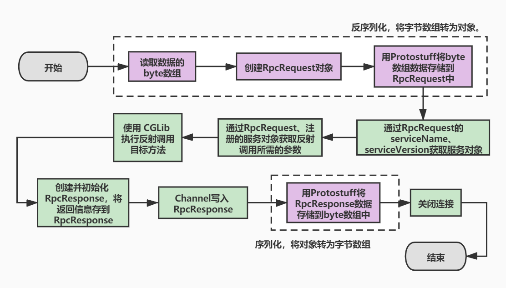

# yuanyuan-rpc

#### 介绍

​	自实现简单的rpc框架。

​	version 1.0：可以完成服务注册，服务发现，服务调用等基本功能。

​	version 1.1：完成一个使用例子，sample-client-demo模块远程调用sample-server-demo模块。

#### 软件架构

1. RPC 服务器（用于发布 RPC 服务）：实现 `ApplicationContextAware`, `InitializingBean`。
    1. `RpcServer`获取bean容器中`@RpcService`注解过的bean。

    2. `RpcServer`初始化`afterPropertiesSet`方法中，启动netty服务器。读写拦截链中有`RpcDecoder`，`RpcEncoder`，`RpcServerHandler`。若有注册中心则将服务信息注册到服务中心中。

        > `RpcServerHandler`处理流程是 `handle(RpcRequest)`获取`RpcResponse`返回结果并关闭连接通道。
        >
        > `handle(RpcRequest)`中调用远程服务为使用 CGLib 执行反射调用。

2. RPC客户端（用于发送 RPC 请求）

    1. 创建并初始化 Netty 客户端。读写拦截链中有`RpcDecoder`，`RpcEncoder`，`RpcClientHeadler`。
    2. 连接 RPC 服务器，写入 RPC 请求数据并关闭连接，返回 RPC 响应对象。

3. RPC 代理（用于创建 RPC 服务代理）

    1. 创建代理的代理对象。代理对象封装请求，创建rpc客户端，发送请求给rpc服务器，获取并返回结果。

4. 基于zookeeper的服务注册中心

    1. `register`注册方法创建 registry 节点（持久），创建 service 节点（持久），创建 address 节点（临时）。

        > service 节点为服务名，address为服务地址。

    2. `discover`服务发现方法，获取 service 节点，获取 address 节点，获取 address 节点的值。

#### 部分功能流程图

1. rpc服务发现、启动流程

    

2. rpc服务处理请求流程

    


#### 学习收获

1. `ApplicationContextAware`：当一个类实现了这个接口（ApplicationContextAware）之后，这个类就可以方便获得ApplicationContext中的所有bean。换句话说，就是这个类可以直接获取spring配置文件中，所有有引用到的bean对象。[link](https://www.jianshu.com/p/4c0723615a52)
2. `InitializingBean`：InitializingBean接口为bean提供了初始化方法的方式，它只包括`afterPropertiesSet`方法，凡是继承该接口的类，在初始化bean的时候都会执行该方法。[link](https://www.jianshu.com/p/f0af22d671a5)
3. [Apache Commons](https://commons.apache.org/)包是Java的工具包，它提供了我们常用的一些编程需要，但是JDK没能提供的机能，最大化的减少重复代码的编写。 
4. [Objenesis ](http://objenesis.org/)是一个小型 Java 库，用于一个目的：**实例化特定类的新对象**。Java 已经支持使用`Class.newInstance()`。但是，这仅在类具有适当的构造函数时才有效。很多时候一个类不能用这种方式实例化，Objenesis 旨在通过绕过对象实例化的构造函数来克服这些限制。
5. 了解序列化，接触多种序列化协议，了解java多种序列化工具及框架。序列化：序列化 (Serialization)将对象的状态信息转换为可以存储或传输的形式的过程。
6. 了解netty，netty的整体架构及其使用。netty：[Netty](http://netty.io/) 是一个提供 asynchronous event-driven （异步事件驱动）的网络应用框架，是一个用以快速开发高性能、可扩展协议的服务器和客户端。

#### 安装

##### 生产组件

```xml
<!-- rpc服务组件 -->
<dependency>
    <groupId>cn.yuanyuan.rpc</groupId>
    <artifactId>rpc-server</artifactId>
</dependency>
<!-- 注册实现 -->
<dependency>
    <groupId>cn.yuanyuan.rpc</groupId>
    <artifactId>rpc-registry-zookeeper</artifactId>
</dependency>
<!-- api接口 -->
<dependency>
    <groupId>cn.yuanyuan.rpc.demo</groupId>
    <artifactId>sample-api-demo</artifactId>
</dependency>
```

##### 消费组件

```xml
<!-- rpc客户端 -->
<dependency>
    <groupId>cn.yuanyuan.rpc</groupId>
    <artifactId>rpc-client</artifactId>
    <version>0.0.1-SNAPSHOT</version>
</dependency>
<!-- 注册实现 -->
<dependency>
    <groupId>cn.yuanyuan.rpc</groupId>
    <artifactId>rpc-registry-zookeeper</artifactId>
    <version>${project.version}</version>
</dependency>
<!-- api接口 -->
<dependency>
    <groupId>cn.yuanyuan.rpc.demo</groupId>
    <artifactId>sample-api-demo</artifactId>
    <version>0.0.1-SNAPSHOT</version>
</dependency>
```

#### 软件使用

##### 注册服务

​	开启一个注册服务，如zookeeper中间件。

##### 生产组件

1. 配置文件

```properties
# rpc服务地址接口
rpc.service_address=127.0.0.1:8190
# 注册组件地址接口
rpc.registry_address=127.0.0.1:2181
```

2. @Configuration注解的类中创建bean。

```java
@Bean
public ServiceRegistry serviceRegistry() {
    return new ZooKeeperServiceRegistry(REGISTRY_ADDRESS);
}
@Bean
public RpcServer rpcServer(ServiceRegistry serviceRegistry) {
    return new RpcServer(SERVICE_ADDRESS, serviceRegistry);
}
```

##### 消费组件

1. 配置文件

```properties
# 注册组件地址接口
rpc.registry_address=127.0.0.1:2181
```

2. @Configuration注解的类中创建bean。

```java
@Bean
public ServiceDiscovery serviceDiscovery() {
    return new ZooKeeperServiceDiscovery(REGISTRY_ADDRESS);
}

@Bean
public RpcProxy rpcProxy(ServiceDiscovery serviceDiscovery) {
    return new RpcProxy(serviceDiscovery);
}
```

3. 代理需要进行rpc调用的类。

```java
@Bean
public HelloService helloService(RpcProxy rpcProxy) {
    return rpcProxy.create(HelloService.class);
}
```

